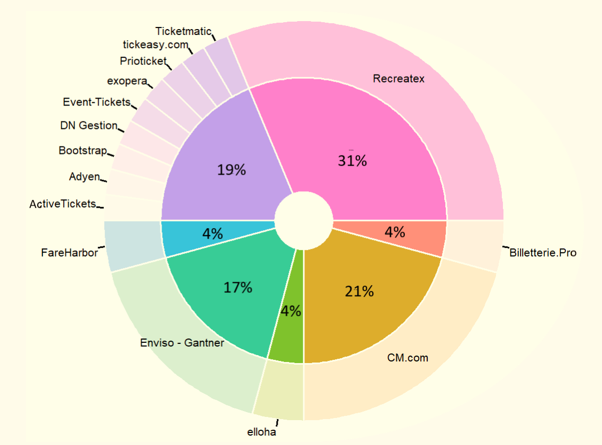
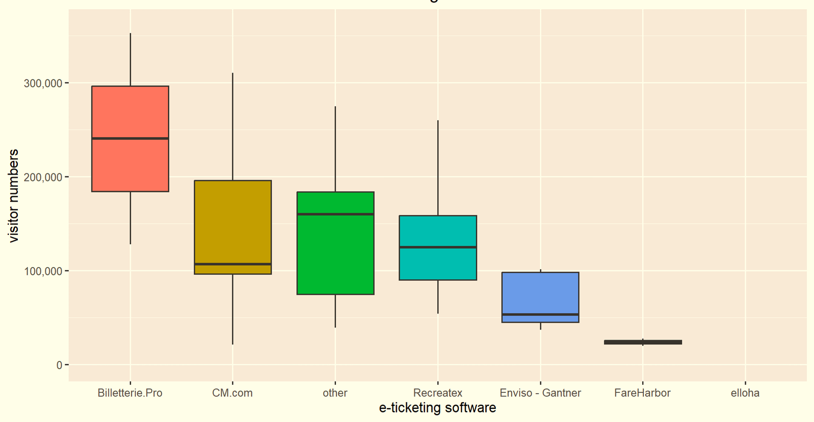
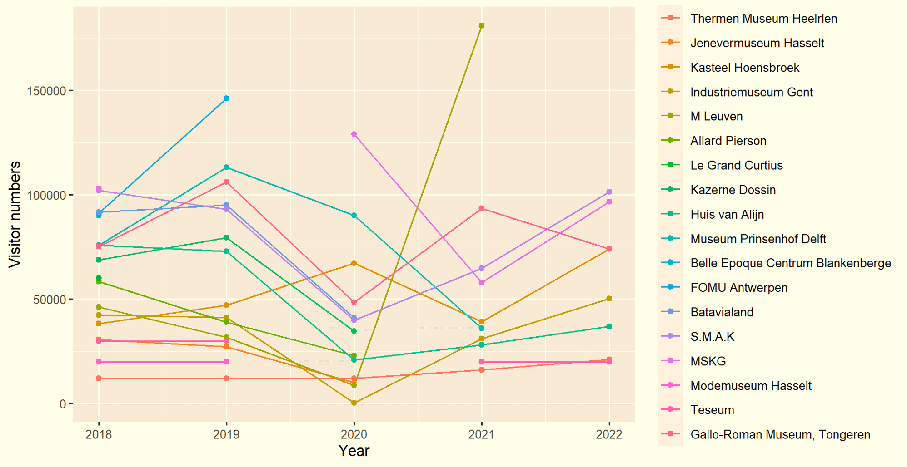

## The situation

During my last Master's semester I did an internship at a Flemish history and archaeology museum. The museum wanted to change their ticketing system, and it was my task to advice them on their choice.

## The task

My project consisted of 5 steps:

1. Getting to know the museum and their ticketing software.

2. Researching alternatives to the ticketing software.

3. Quantitative research: survey of other museums.

4. Qualitative research: in depth interviews of other museums.
 
5. Presenting results to the museum director and board members.

## The data

I collected data about museums in Belgium and the Netherlands with similar profiles to my target museum, and looked at the proportion if e-tickeing softwares they use.

Then, I looked at whether the choice of software has something to do with the annual visitor numbers, which could be a crucial deciding factor.

It is also essential to just simply have an overview of the dynamics of visitor numbers, regardless of the software they ar using.

And then also taking the softwares into account, which could signal that using a certain software can potentially boost or reduce visitor numbers.

This was followed by conducting interviews with 5 museums. The aim of the interviews was to find out the advantages and disadvantages of the current e-ticket systems these other museums were using, and compare their future plans and views in the industry. Additional information was gained about the organisational, process and technology factors of the software implementation, which served as a base material for my Master's Thesis, which you can find attached.

Download: [Thesis PDF](Data-Driven-Strategies-in-Museums.pdf)

## The result

My research uncovered the sad fact, that the digital-technological world in museums is only something that big-sized museums can afford. Because most of  these organisations are dependent on the government, their budget is based on their visitor numbers. Unfortunately, there are just few high-visitor number museums, and most of them are small and medium sized. These smaller museums have neither the money nor the resources to hire tech-focused people, improve their operations and boost their visitor numbers. That is why these museums have to cooperate and fight for their common interest in the digital transformation. This way, with a greater market power they can create their own software for museums, which will be fully tailored to their needs.

