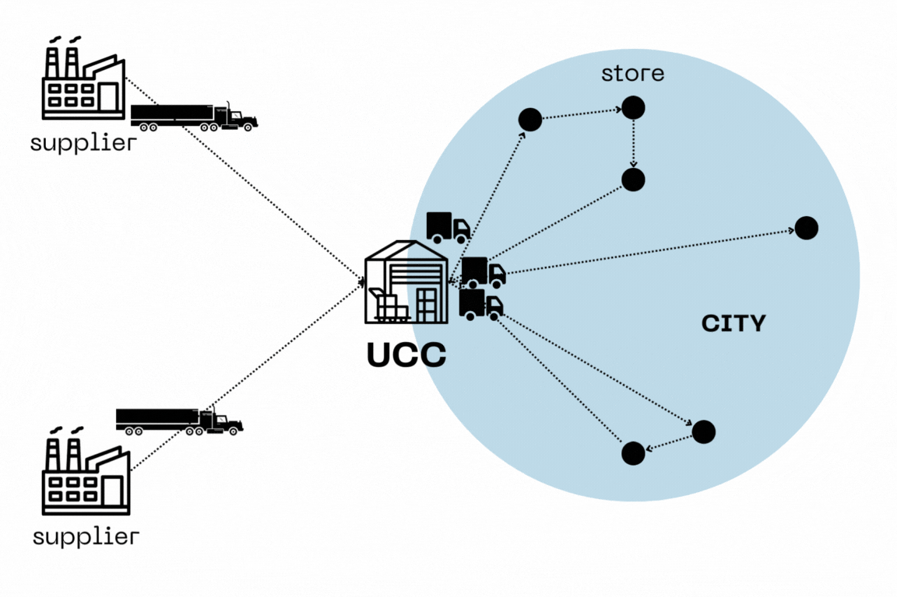

The purpose of the Smart Service Project was to create a smart service for a stakeholder included in the Elevtric Vehicle (EV) market transformation in the Netherlands. We have chosen the local Urban Consolidation Center (UCC), Goederenhub in Maastricht as our stakeholder, and as the end product we provided a dashboard with KPIs for the green transition.

The project includes the following steps:
1. A model is trained that predicts the number of businesses per Maastricht region per business type. 
2. Survey data is used to determine the average number of pallets delivered per business type in Maastricht.
3. These values are used to determine the total logistic demand (in pallets) of Maastricht.
4. This information is then exported to be used by our dashboard that will make further calculations (number of trucks required, amount of electricity etc.)

## The situation

In the Netherlands, some municipalities signed up to be zero emission zones by 2025. This means, that from 2025 onwards, in these municipalities fuel based cars will face restrictions, and only the ones that are emitting considerably less are going to be let inside the city. This regulation is going to be even stricter in 2030, when only EVs will be allowed to enter. There are many areas that are going to be impacted by these changes, and one of them are UCCs.   
These logistic facilities function as connectors between the suppliers and the end-users. The large trucks drop their products at the UCCs, usually located at the border of the city, and then the smaller vans of UCCs distribute the products inside the city. Hence, their operation is within city borders where the new environmental regulations will be imposed. That is why UCCs need to start thinking about the green transition of their services. However, as we noticed, they don't have the knowledge and resources for appropiate estimations. That is why our team jumped in, and offered a solution. 



The goal was simple. Just help the UCC decide how many electric vans they will need. But this depends on a lot of things. Our team followed a logistic demand approach, where we predicted the number of vans based on the logistic demand in Maastricht. But how exactly did we do that?

## The data

So, basically we had two data sources to start: on one hand, the number of stores per sector per district in Maastricht, and on the other a self-conducted survey about store deliveries. Let's see why these things are relevant for calculating logistic demand.

### Number of businesses

The main client of UCCs are businesses. They don't deliver to customers directly. There are already specific companies like DHL or the national postal service who are taking care of that. Hence, to estimate how many electric vans the UCC needs, we have to know how many potential businesses can be targeted as clients in the upcoming years. These vary widely according to the type of activities and the location of the business, that is why we took the sector and the district into account. Thus, based on historical data from the past 10 years, we predicted the number of businesses in the upcoming years. To do this, we used the *compare_models* function from the *pycaret* package, which assigned to each business type a best fit model. 


```r
if train_models:
    # Define the different business types.
    # Omitted "OQOverheidOnderwijsEnZorg" - Not enough data
    business_types = ["BFNijverheidEnEnergie",
    "GIHandelEnHoreca", "HJVervoerInformatieEnCommunicatie",
    "KLFinancieleDienstenOnroerendGoed",
    "MNZakelijkeDienstverlening",
    "RUCultuurRecreatieOverigeDiensten"]

    # Create a dictionary to contain all the trained models
    model_dict = {}

    # For every business type, train a model
    for business in business_types:
        print("Now training: " + business)

        # Drop all rows without values
        business_ts = ts_data.dropna(subset=[business])
        business_data = data.dropna(subset=[business])

        # Set up the model training
        # removing multicollinearity (threshold=0.9)
        #setup(
        #    data = business_data,
        #    remove_multicollinearity=True,
        #    ignore_features=["BedrijfsvestigingenTotaal",
                              "Codering", "ID",
                              "year", business_types]
        #)

        # removing multicollinearity (threshold=0.9)
        setup(business_ts,
                    session_id=1,
                    target=business,
                    fold_strategy='timeseries',
                    ignore_features=
                    ["BedrijfsvestigingenTotaal",
                     "Codering", "ID", business_types],
                    fold=5,
                    remove_multicollinearity=True,
                    )

        # Train the models and store the best model
        best_model = compare_models()
        final_model = finalize_model(best_model)
        model_dict[business] = {"Model": final_model,
                                "Business_type": business}

        print(model_dict)
```


### Delivery survey

While data about the number of business was available, the number of deliveries is not recorded in public datbases. Therefore, out team took the initiative, and created a quick survey about the deliveries in Maastricht. The survey included the following questions:  

  1. How often do you order deliveries?
  2. What is the range of each delivery expressed in EUR palettes?
  3. Who is your supplier?

To make the decision easier, we already included the potential answers  and ask the respondents to choose. Thus, with this user-friendly survey, we manage to contact around 80 businesses in Maastricht, covering all business types in all districts. Now, we had an idea about the volume and frequency of the total demand for UCC services. 

### Combining the 2 datasets

The real magic happens when we combine these two datasets. If we simply multiply the number of predicted businesses in a sector with the average number of pallets delivered per business type, then these values represent to total logistic demand in pallets in Maastricht. These values are the base for the further scenario calculations and market share targets fro the dashboard.


## The dashboard

As a visual person, it is hard for me to grab the true insights of the data analytics results by just looking at numbers. Especially, when so many different factors need to be considered, the UCC needs to be able to personalize the predictions according to its needs and preferences. So, we created 3 scenarios with Monte Carlo simulation, a good, and average and a bad one. 

 
```r
mean = survey_df['Average_Total_number_of_palletes_per_month'].values.mean()
std_dev = survey_df['SD_Total_number_of_palletes_per_month'].values.mean()
num_samples = 1000

samples = np.random.normal(mean, std_dev, num_samples)

mean_samples = np.mean(samples)
std_dev_samples = np.std(samples)

```

<script src="https://code.highcharts.com/highcharts.js"></script>
<script src="https://code.highcharts.com/modules/histogram-bellcurve.js"></script>
<script src="https://code.highcharts.com/modules/exporting.js"></script>
<script src="https://code.highcharts.com/modules/accessibility.js"></script>

<figure class="highcharts-figure">
    <div id="container"></div>
    <p class="highcharts-description">
    </p>
</figure>


<style>

.highcharts-figure,
.highcharts-data-table table {
    min-width: 310px;
    max-width: 800px;
    margin: 1em auto;
}

.highcharts-data-table table {
    font-family: Verdana, sans-serif;
    border-collapse: collapse;
    border: 1px solid #ebebeb;
    margin: 10px auto;
    text-align: center;
    width: 100%;
    max-width: 500px;
}

.highcharts-data-table caption {
    padding: 1em 0;
    font-size: 1.2em;
    color: #555;
}

.highcharts-data-table th {
    font-weight: 600;
    padding: 0.5em;
}

.highcharts-data-table td,
.highcharts-data-table th,
.highcharts-data-table caption {
    padding: 0.5em;
}

.highcharts-data-table thead tr,
.highcharts-data-table tr:nth-child(even) {
    background: #f8f8f8;
}

.highcharts-data-table tr:hover {
    background: #f1f7ff;
}

</style>


<script>

const data = [2.65570989e+01,  6.10410141e+01,  9.25569147e+01,  9.18188403e+01,
        1.03183980e+02, -3.43593751e+01,  1.01647354e+02, -1.09830565e+02,
        5.91137970e+01, -8.31642152e+01,  6.20398990e-02, -3.78696668e+01,
        2.35798408e+02,  6.14053532e+01,  1.71353236e+01,  1.21511980e+02,
        1.40214837e+02,  1.04864663e+02,  1.63104065e+02,  5.05227552e+01,
       -4.28747798e+01, -9.87763570e+01,  1.36981425e+02,  1.72183181e+02,
       -8.42765453e+00,  5.89251590e+01, -9.06201438e+01, -3.34259600e+01,
        1.33852282e+02,  2.40944360e+02, -5.59430580e+01, -1.30477208e+01,
        1.27858753e+02,  1.25207053e+02,  4.69081621e+01,  8.30808502e+01,
       -1.75395501e+01,  1.56941989e+02,  2.59718877e+01, -2.51560820e+01,
        8.04128249e+01,  9.95666535e+01,  4.89397868e+01,  6.93857188e+01,
       -2.02476089e+02, -6.62817729e+01, -2.00393513e+01, -1.07024838e+02,
        1.86290252e+02, -6.02665114e+01,  5.92311560e+01, -7.76589633e+01,
        7.12946947e+01, -6.29131386e+01, -7.47241986e+01,  1.65291993e+00,
        2.36730018e+01, -8.31621425e+00,  9.92867500e+01, -5.27211696e+01,
        1.62524519e+02, -1.93667379e+01,  1.50648098e+02,  1.38288734e+02,
        5.52215101e+01,  6.62772545e+01,  9.55541841e+01,  9.67416796e+01,
        4.85012440e+01, -4.57307531e+01, -5.33524508e+01,  1.18672417e+02,
       -3.14703747e+01, -6.38858126e+01,  6.00331111e+01, -4.11194044e+01,
        2.10640865e+01,  7.33208334e+01,  1.07523059e+02,  1.47243806e+01,
        1.27103544e+02,  4.57678189e+01,  2.40378190e+02,  3.62430801e+01,
        1.41749596e+02,  9.43274427e+01, -5.33797454e+01,  1.01847407e+01,
        2.74661745e+00,  9.71676928e+01,  1.95644506e+02,  7.66923467e+01,
       -1.43401591e+02, -2.96953917e+01,  1.25910690e+02, -1.08680853e+02,
        1.20911142e+02, -3.83224619e+01,  2.23213291e+02,  1.33893858e+02,
        8.07907532e+01,  6.60137404e+01,  5.56946476e+00,  1.40896466e+02,
        9.98928888e+01, -1.77490148e+01,  5.23260704e+01,  1.06067872e+02,
        8.20663359e+01,  1.55713889e+02, -8.28976317e+01, -1.03180336e+02,
        1.88549689e+02, -6.07167070e+01,  1.89388546e+02,  1.28701082e+02,
        5.63679502e+01, -1.80550516e+01,  3.65758530e+01, -3.00968243e+01,
        3.51261218e+01,  1.65899950e+02,  8.34878402e+01,  1.14517922e+02,
       -1.71783929e+01, -2.70613928e+01,  1.04720313e+00, -7.12852115e+01,
        1.55813461e+02, -2.91924429e+01,  1.39735966e+02, -3.05627836e+01,
        1.43631143e+02,  2.95958084e+01, -3.07078028e+01,  2.08899036e+02,
       -1.89967776e+01, -9.08260435e+01,  9.58868328e+01, -5.48915558e+00,
        4.01170394e+00, -7.06239942e+01, -4.38348155e+01, -2.36328317e+02,
        2.52722877e+01, -9.12826179e+01,  1.52353013e+02, -2.53001001e+01,
        1.21146347e+01,  1.42466767e+02,  7.19265220e+01,  6.19606199e+01,
        7.33194408e+01, -4.92410985e+01,  2.76263800e+02,  1.14467933e+02,
        1.11554396e+02,  1.20936423e+02,  3.67506124e+01,  8.98090358e+01,
        1.20376815e+02, -1.68874141e+02,  1.49822812e+02,  3.16216093e+01,
        1.14020977e+02,  1.19244066e+02, -2.13688745e+01, -7.11580058e+01,
        3.14536174e+01,  8.87980815e+01,  1.62615144e+02,  3.34331972e+01,
        3.39002539e+01, -6.15224459e+01,  4.39455944e+01, -1.21126818e+01,
        1.40042043e+02,  2.61753916e+01,  5.84759325e+01,  1.04972629e+01,
        5.68216394e+01,  1.37893590e+02,  2.79322553e+01,  5.42168746e+01,
        7.22792263e+01,  1.39583304e+02, -9.02260481e+01, -1.16304811e+01,
        3.06545108e+01, -1.68992782e+01,  2.36930404e+01,  4.68088593e+01,
        2.56728109e+02, -9.00359435e+01,  4.55765144e+00,  1.09174359e+02,
        2.56729455e+02,  1.04338571e+02,  2.17467384e+02, -3.82652182e+00,
        3.20124108e+01,  3.13348865e+01, -3.27109230e+01,  1.13521812e+02,
        2.15071196e+01, -6.04207260e+01, -6.52982517e+01,  6.89040394e+01,
        8.55745601e+00, -4.37916409e+01,  2.28174189e+01,  1.08211325e+02,
       -7.38968230e+01,  5.02737174e+01,  1.03177183e+02,  3.20985498e+01,
        1.01953072e+02,  4.87762889e+01, -1.13352762e+02,  1.31324806e+01,
        1.67958339e+02, -4.78250924e+01,  8.77938359e+01, -1.08907374e+02,
       -2.46652997e+00,  5.91783186e+01,  6.41222084e+01, -7.31960300e+01,
        5.58670007e+01, -3.18626451e+01,  4.30702307e+01, -2.33893750e+01,
       -9.86087951e+00, -8.99809532e+01,  4.62349568e+01,  4.20351382e+01,
        2.54330537e+01, -7.45551140e+01,  1.91384051e+02,  9.38917720e+01,
        3.89013493e+01, -3.74564507e+01, -6.97269604e+00,  1.34692143e+01,
        2.56588891e+01, -6.72258144e+01,  3.60814194e+01, -1.12371088e+02,
       -7.97815159e+01,  2.26770752e+02, -3.29103632e+01,  9.01816842e+01,
       -1.93726749e+01, -2.89050345e+01,  8.42219001e+01,  1.20398359e+02,
        1.14003209e+02,  6.11281642e+01,  8.07789754e+01,  4.27161277e+01,
       -9.90885279e+01,  1.22953720e+02, -8.29440789e+01,  1.37121105e+02,
        5.82714808e+01, -1.05912483e+02, -2.85979189e+01, -6.64440613e+01,
        1.50267486e+02, -1.70422206e+02, -7.43653199e+01, -4.22197927e+01,
        1.42234934e+02,  9.32770442e+01, -9.82280312e+01, -1.80840309e+02,
        2.38207545e+00,  2.31019667e+02, -6.92655383e+01, -1.63982431e+02,
        5.26658572e+01,  2.34569970e+01,  1.97862561e+01,  1.23304480e+02,
        1.17907248e+02,  1.44058277e+02,  1.64860250e+02,  7.06834834e+01,
       -3.85324666e+01,  1.30420034e+02, -2.91652070e+01,  1.53908130e+01,
        1.19764474e+02,  3.08541502e+01,  3.13304237e+01,  1.85896828e+02,
        4.65571302e+01,  9.07885357e+01,  5.18667132e+01,  1.21326626e+02,
        1.04988461e+02,  5.08531759e+01,  1.15167624e+02, -8.30318352e+01,
        3.17598942e+01, -2.43635233e+01,  1.21720449e+01, -2.28238960e+01,
        1.42978113e+02, -1.47885327e+01, -6.99951164e+00,  1.18879428e+02,
        4.23635996e+01,  3.87817266e+00, -3.49165516e+01,  1.15783966e+01,
        6.74984835e+01,  5.75805761e+01,  2.41282962e+01, -1.01027204e+01,
        1.07145955e+02,  5.63186615e+01, -9.52506644e+01,  5.76339717e+01,
        9.02389195e+01, -8.34643308e+01,  4.87037272e+01,  9.33414126e+01,
       -4.24146512e+01,  1.11773438e+02,  5.50451074e+01,  1.12488980e+01,
       -3.97906666e+00,  5.81645854e+00,  4.00820497e+01,  1.23176017e+01,
       -8.41301249e+01,  9.69852920e+01, -9.82914721e+01, -2.39269476e+01,
        1.20473285e+02, -9.86453425e+01,  4.91784090e-01,  4.55754295e+01,
       -9.79412770e+01, -2.47159412e+01,  6.40578244e+01,  1.17600053e+02,
        5.42496692e+01, -3.12970907e+00, -5.92872232e-01,  1.49464570e+02,
        5.37945515e+01,  5.23903564e+00,  3.03249602e+01, -1.04156308e+02,
        4.22677425e+01, -2.12006476e+01, -1.24045975e+02,  9.80090921e+01,
        4.43835986e+01,  1.36794704e+02,  9.62062680e+01, -2.34441049e+01,
       -1.26107485e+02,  1.64087515e+02,  8.06126880e+00,  4.37933123e+01,
       -2.39863696e+01, -4.99149610e+01,  8.63803219e+01, -1.12760658e+02,
        1.24512034e+02,  5.05070534e+01,  2.79312277e+02,  3.25680051e+01,
       -6.04122095e+01,  1.94397226e+01, -7.99099821e+00,  1.17465841e+02,
        6.26459028e+01,  8.86676709e+00,  6.08478965e+01,  1.14160776e+02,
        1.35673451e+02,  1.99222641e+02, -1.18073343e+02,  6.41224600e-01,
        1.39629015e+02, -5.58502437e+00,  4.89940738e+01,  1.74974770e+02,
        7.22845132e+01,  4.64316626e+01,  7.80137159e+00,  7.04061560e+01,
       -7.24936202e+01, -1.28790370e+01,  3.85624682e+01,  9.74108456e+01,
        1.25824545e+02,  1.57834501e+02,  3.95085068e+01,  2.57246168e+01,
        1.56347487e+02, -2.84113041e+01, -1.91981015e+01,  2.37863364e+01,
        3.87273378e+01,  1.85505318e+02,  5.66885940e+00,  3.71583771e+01,
        1.06140469e+02,  4.38859789e+01,  1.04572609e+01,  7.21727456e+01,
        2.09959340e+02,  4.05895111e+01,  4.38706289e+01,  1.05249957e+02,
        1.50248741e+02,  9.70303189e+01,  6.99276589e+01, -5.26056621e+00,
        2.34264811e+01,  7.66798982e+01,  6.53232382e+01,  7.07986603e+01,
        5.94026449e+01, -2.77017310e+01,  1.87174260e+02,  1.25630873e+02,
        6.75424185e+01,  3.10094945e+01,  6.94619432e+01, -6.52797899e+01,
        3.87383042e+01, -1.16658573e+01,  5.99722892e+01,  1.38134263e+02,
        4.95616348e+01, -1.39739328e+02,  6.81958393e+00, -1.00779202e+02,
        6.51038304e+01,  1.27600630e+02, -9.96043923e+01, -1.20130034e+02,
       -3.68594605e+01, -7.56162471e+01, -1.42745287e+01,  1.62301416e+01,
       -2.01783194e+00, -5.23751225e+01,  5.18889991e+01, -1.03257052e+02,
        1.26964288e+02,  2.29571023e+01,  5.24748157e+01,  3.34488671e+01,
       -8.93687824e+01, -1.45336584e+02, -2.02607416e+01, -3.97496426e+01,
        3.81103484e+01, -7.84020880e+00,  1.29459457e+02, -1.83784938e+02,
        1.19230887e+02,  4.67012367e+01, -8.28677326e+01,  2.03123771e+01,
       -2.91183750e+01,  5.67513222e+01,  7.41187406e+00, -1.59484218e+01,
       -5.09676347e+01,  6.67398013e+01,  1.79822745e+01, -1.98717224e+01,
       -4.10280182e+01,  1.97963656e+02,  1.30078047e+01,  2.73152544e+00,
        4.93264046e+01,  7.16778130e+01,  2.13042511e+02, -8.80716371e+01,
        9.44078449e+01,  6.45455017e+01,  8.57452794e+01, -1.17273934e+01,
       -2.04614022e+01,  2.77277979e+01, -1.57024551e+01,  4.04161543e+01,
        8.10259185e+01,  4.19185144e+01,  1.36270391e+02,  1.43816901e+02,
        9.82615114e+01,  1.73810123e+02,  1.17145089e+02,  1.90017244e+02,
        1.19731734e+02,  2.05828409e+02,  5.48606506e+01,  1.06926927e+02,
        9.51287121e+01,  1.51072979e+02,  3.95039169e+01,  1.56351851e+02,
        1.60496546e+02, -1.17441571e+02,  6.35640669e+01,  9.46626515e+01,
       -7.37763618e+01, -9.95160431e+00,  5.97813983e+01,  1.60191522e+02,
        2.12196952e+01, -7.89711993e+00,  8.17687677e+01, -6.75215900e-01,
        5.75972525e+01, -2.35342381e+01, -7.96092598e+01, -1.42712759e+01,
       -1.83576779e+01,  2.30629481e+01,  1.52517461e+02, -5.86534170e+01,
        1.20050908e+02, -3.46742991e+00,  2.96605957e+01, -1.16131223e+02,
        1.37468337e+02,  9.63384651e+01,  1.56818018e+02,  5.99732485e+01,
        9.84615657e+01,  2.16464881e+01,  9.02642310e+01, -7.46752891e+01,
        1.44244954e+02, -2.69269222e+01, -8.00555926e+01,  5.58603475e+00,
       -4.01033486e+00,  1.31578557e+02,  9.44522221e+00, -4.37044983e+00,
        2.92827630e+00,  1.03013639e+02,  9.90118117e+00,  4.71099264e+00,
       -6.10177580e+01, -1.69555542e+02,  5.11568430e+01, -4.46066719e+01,
        1.59948893e+02,  6.02772512e+01,  1.03052090e+02,  1.69637628e+02,
       -1.34560457e+02,  1.03355699e+02,  1.23912882e+02, -4.47136239e+01,
        2.25006961e+02, -8.66856744e+01,  2.38509783e+02, -5.78422673e+01,
        7.76336840e+01, -3.33359708e+01,  1.09783363e+02,  6.69089782e+01,
       -9.90321543e+01, -8.93332710e+01,  1.02206479e+02,  1.32070879e+02,
       -6.16071094e+01, -1.82204973e+01, -4.09219740e+01,  3.68039198e+01,
       -1.24876541e+02,  1.25128201e+02, -3.77760348e+01, -2.53676487e+01,
       -6.07373780e+01,  3.65107774e+01,  1.44318090e+01,  4.22679741e+01,
       -1.00500597e+02,  1.83385013e+02,  5.93628661e+01,  8.58813021e+01,
       -3.60939264e+01,  6.93822630e+01,  3.20774038e+01,  6.21526910e+00,
        1.27882425e+01, -2.56631041e+01,  5.71887700e+01, -4.57997565e+00,
       -1.05433773e+02, -1.25557448e+01, -4.20356526e+01,  2.09188229e+02,
        1.31020491e+02,  6.84717060e+01,  7.19204605e+01,  4.74554988e+01,
        1.62483103e+02, -5.86953193e+01, -2.58809850e+00,  7.14948532e+01,
        1.86374283e+01,  9.44769122e+01, -7.41823978e+01,  4.14246893e+01,
        2.14721850e+01, -1.17438661e+02,  1.35662322e+02,  9.18600696e+01,
        5.69225070e+01,  1.53920427e+02,  8.70574175e+00, -5.19200073e+01,
       -1.31036746e+02, -3.61526462e+01,  8.58096780e+01,  9.91989861e+01,
        1.05348714e+02, -2.46043017e+01,  3.26511254e+01,  1.70598271e+01,
        1.29453886e+02,  5.41166200e+01,  1.24013960e+02,  1.62395428e+02,
       -4.99032827e+01,  3.52232900e+01, -4.62684329e+01,  1.33506394e+02,
        8.66957466e+01, -2.59537569e+01,  2.91432222e+01,  1.66513756e+01,
        2.52956164e+02,  3.24288189e+01,  5.36335882e+01, -9.12104848e+01,
       -1.65864320e+01, -1.64492843e+02,  2.10561303e-01,  1.65055714e+02,
       -1.70823184e+01, -7.03785198e+01, -1.13592108e+02,  4.47397023e+01,
       -1.06943244e+02,  1.09823400e+02,  1.75854367e+02, -3.54539767e+01,
        7.27358904e+01,  1.07106127e+01, -3.88281346e+01,  6.88427811e+01,
        3.88468590e+01,  1.29479502e+02, -7.60552894e+01,  1.08197660e+02,
        5.85912395e+01, -6.51892037e+01,  2.29784532e+02,  2.39160325e+02,
       -1.48132682e+01,  3.59451669e+01, -8.97388139e+00,  4.44394044e+01,
        4.86063251e+01,  6.14412834e+01,  7.99306984e+01,  7.30834073e+01,
       -4.41269407e+01,  1.82787615e+02, -8.99339582e+01, -1.08455584e+02,
       -7.63874548e+01,  1.61472443e+02,  9.21000929e+01,  8.29127622e+01,
        4.36624559e+01,  1.29169760e+02,  1.20329907e+02,  2.48979821e+01,
        5.44775443e+01,  5.75523353e+01,  2.56702798e+02,  1.05540557e+02,
        6.24915807e+01,  7.65171740e+01,  6.83918174e+01,  2.37066267e+02,
       -5.46666220e+01,  2.06589911e+01, -5.03904472e+01, -5.18092666e+01,
        1.03235283e+02,  6.26145491e+01,  1.36500338e+01,  1.53844424e+01,
        8.34092629e+01, -6.54947887e+01,  2.93741875e+01,  1.14922313e+02,
        1.65923112e+02,  1.06580707e+02, -7.70422283e+00, -1.41535588e+00,
        2.08491281e+02,  2.74997619e+01, -4.11169135e+01,  1.05225397e+02,
        2.46868362e+00,  5.15637957e+01,  2.81659988e+02,  2.26453439e+01,
       -8.01709074e+01,  1.65797291e+01, -4.37483618e+01,  2.86289271e+01,
       -1.97042050e+01,  5.48723284e+01,  9.43615234e+01,  4.42566930e+01,
        8.70418825e+00, -5.17181941e+01,  4.14944731e+01,  3.98674225e+01,
        7.29284461e+01,  6.99433859e+01, -4.39811968e+01, -1.11688897e+02,
        3.89440678e+01, -9.87408697e+00, -1.08159154e+02,  9.21761437e+01,
       -1.17438868e+02,  6.87012889e+00, -1.75548889e+02, -7.37942904e+01,
       -8.94405534e+01, -4.58297947e+01, -1.21665922e+02, -7.46582347e+01,
        1.25750026e+01,  7.44234953e+01, -1.17586739e+02, -5.15471215e+01,
        3.94014169e+01, -8.33121338e+01, -3.46860862e+00, -2.13301684e+01,
       -1.03556995e+02,  1.23094959e+02,  6.69152312e+01,  2.35867769e+00,
       -2.44636685e+01,  1.75600698e+01, -1.55397399e+02,  2.93275807e+01,
       -7.96162442e+00, -3.66333166e+01,  8.61381503e+01,  1.47225141e+02,
        1.22883774e+02, -2.84701652e+01,  1.08999774e+02,  9.75065596e+01,
        2.39921350e+01, -4.36788074e+01, -4.04644215e+00,  4.10261380e+01,
        8.01967164e+01, -9.06798766e+01,  1.22991659e+02,  1.81893413e+00,
       -3.63584912e+01,  2.10755153e+02, -4.01169638e+01,  6.00280028e+01,
        9.63624008e+01,  1.04170993e+02, -5.78600957e+00, -1.79889069e+02,
        5.70584120e+01,  8.20293663e+01,  4.74035952e+01,  1.34648347e+02,
        4.94321253e+01,  1.53884830e+02,  2.18218838e+02, -3.56265390e+01,
        1.31632113e+02,  2.58547391e+01,  1.08223637e+02, -2.15832835e+01,
       -8.29521681e+00,  5.12521121e+01, -8.37288358e+01,  2.51176147e+01,
        6.12114147e+00,  2.95783793e+01,  1.64330372e+02,  1.49063871e+02,
        1.09517556e+02,  5.90934197e+01,  2.07922238e+01,  5.79736942e+01,
       -9.36283224e+00,  2.00913017e+01,  1.73003176e+02, -8.69375183e+00,
       -2.11666845e+02,  7.54706585e+01,  1.30994769e+02, -4.75552521e+01,
        2.09163238e+01, -1.68127559e+02,  3.47795942e+01,  2.97620634e+00,
       -1.47587773e+02,  7.54950044e+01,  6.01539124e+01,  1.29821330e+02,
        1.48392870e+02, -1.52004388e+02,  1.97363392e+02,  9.37168963e+01,
        7.37146665e+01, -2.36286267e+00,  6.43197494e+01,  1.93980227e+01,
       -8.22141196e+01, -2.45107443e+01, -1.92435659e+01,  1.78795778e+01,
        1.34328498e+02,  5.58067804e+01, -8.73907778e+01,  1.11497986e+02,
       -5.51534638e+01,  2.51460090e+01, -2.42217782e+02,  4.85805715e+01,
       -4.32071384e+01,  7.66617039e+01,  5.05801954e+01, -2.38804565e+01,
        1.33604838e+02,  4.12551787e+01,  5.81700757e+00,  1.63448394e+02,
        1.76588467e+02, -2.32280978e+01, -1.41639128e+01, -2.28145639e+02,
       -3.68100759e+01,  1.70954684e+02,  2.21155480e+02,  8.01136503e+00,
       -1.95194271e+01,  1.89562118e+01,  1.49750822e+02,  7.99508475e+01,
        2.12582375e+00,  2.40574641e+01, -2.37109876e+00, -4.75727373e+01,
       -5.97350211e+01,  1.40287163e+02,  6.94057294e+01,  6.63497928e+01,
        3.29377955e+01,  2.22177094e+01,  1.80668700e+02,  1.68983044e+02,
        1.75334134e+02, -7.69446663e+01,  3.32000579e+01,  9.82490678e+00,
        1.13355619e+02,  1.26325466e+01, -2.24823282e+01,  1.43169713e+02,
       -2.41081214e+00, -2.59645271e+01, -8.86398339e+01,  2.87674690e+01,
       -2.33257925e-01,  1.81713608e+02,  9.54852505e+01,  1.03270359e+01,
       -5.59740821e+01, -7.41813257e+01,  6.26476440e+01,  1.09734472e+02,
        1.15374026e+02,  1.43911103e+00,  3.43007198e+00,  1.42749409e+02,
       -1.17834877e+02,  4.50981004e+01,  1.55007672e+02, -1.06727780e+02,
       -7.81503671e+01, -1.58119586e+01,  6.69935488e+01, -9.21300465e+01,
        5.18005523e+01, -7.26224552e+01, -1.61809344e+01,  1.08041411e+02,
       -6.61868012e-01,  1.21621866e+02, -6.24351405e+00,  3.51003345e+01,
       -4.69424723e+01,  2.94840401e+01,  5.11175631e+01,  2.40347529e+01,
       -2.35719505e+00,  8.06680136e+01,  5.61032271e+01,  3.29785969e+01,
        1.39954571e+02,  9.60815468e+00, -6.10199134e+01,  2.73242348e+01,
        2.08242079e+02,  7.76652738e+01,  2.04447132e+01,  1.31653702e+01,
        1.85302451e+02, -2.88810499e+01,  1.35409816e+02, -4.68340795e+00,
        4.21267474e+01, -1.69226198e+01,  6.59442369e+01, -3.25425135e+01,
       -9.71643598e+00,  6.78770382e+01, -6.92221512e+01,  1.95533708e+02,
        1.42101977e+01,  2.94967456e+01,  3.10793694e+01, -1.64148421e+01,
        2.13534998e+01,  8.02896196e+01,  1.81179535e+02,  1.73893797e+02,
        1.10884814e+02,  9.01899892e+01, -1.22806456e+02, -4.02378352e+01,
        9.89287833e+01,  2.20802518e+01,  7.46395630e+01,  4.50846135e+01,
        1.34905548e+02,  1.03050409e+02, -4.79505194e+01,  1.00980797e+02,
        4.14599781e+01,  1.44660030e+02,  2.14324572e+02, -6.31975310e+01,
        6.95674442e+01, -7.62611680e+01,  1.26171590e+02,  1.00663031e+02,
       -3.55493211e+01,  4.38738403e+01,  8.88475030e+00,  1.26912893e+02,
        3.39862489e+01,  9.72243142e+01,  5.82357297e+01,  2.59361703e+01,
        8.36467914e+01, -1.88593014e+01, -5.05583081e+01, -1.19082480e+02,
       -6.77905405e+01,  9.96544056e+01,  1.60538678e+02, -3.99600962e+01];

Highcharts.chart('container', {
    title: {
        text: ' Monte Carlo simulation'
    },

    xAxis: [{
        title: { text: 'Logistic Demand' },
        alignTicks: false
    }, {
        title: { text: 'Histogram' },
        alignTicks: false,
        opposite: true
    }],

    yAxis: [{
        title: { text: 'Probability' }
    }, {
        title: { text: 'Histogram' },
        opposite: true
    }],

    plotOptions: {
        histogram: {
            accessibility: {
                point: {
                    valueDescriptionFormat: '{index}. {point.x:.3f} to {point.x2:.3f}, {point.y}.'
                }
            }
        }
    },

    series: [{
        name: 'Histogram',
        type: 'histogram',
        xAxis: 1,
        yAxis: 1,
        baseSeries: 's1',
        zIndex: -1
    }, {
        name: 'Data',
        type: 'scatter',
        data: data,
        id: 's1',
        marker: {
            radius: 1.5
        }
    }]
});

</script>

```r
Mean logistic demand: 34.328042486634594
Standard deviation of logistic demand: 83.22530494848071
```

Using the results, 3 scenarios got generated:

```r
# Set thresholds for scenario selection
threshold_bad = np.percentile(samples, 2.5)
threshold_good = np.percentile(samples, 97.5)

# Categorize the simulated outcomes
good_scenarios = samples[samples >= threshold_good]
middle_scenarios = samples[
(samples < threshold_good) & (samples > threshold_bad)]
bad_scenarios = samples[samples <= threshold_bad]

# Calculate the probabilities of each scenario
prob_good = len(good_scenarios) / num_samples
prob_middle = len(middle_scenarios) / num_samples
prob_bad = len(bad_scenarios) / num_samples

# Randomly choose a value from the good scenarios
good_value = np.random.choice(good_scenarios)

# Randomly choose a value from the middle scenarios
middle_value = np.random.choice(middle_scenarios)

# Randomly choose a value from the bad scenarios
bad_value = np.random.choice(bad_scenarios)
```

```r
Good scenario: 265.58043669036647
Middle scenario: 127.81779907707494
Bad scenario: -178.9709625656634
Probability of a good scenario: 0.025
Probability of a middle scenario: 0.95
Probability of a bad scenario: 0.025
``` 
 
Furthermore, we identified the KPIs and with some thorough research we conducted the necessary calculations. We gave multiple vehicle options to choose from, but after all, they are just the fixed costs. That is why we also included the variable costs stemming for the energy consumption, which are also relevant for UCCs.

Moreover, to bring the personalization to another level, we gave the option to select specific business sectors and market share targets, to fit the predictions to the plans of the UCC. So, now the end product is a true competitive advantage for UCCs, not just decide the number of electric vans they need, but also to prepare for future energy consumptions, costs, and improve their commercial power.





