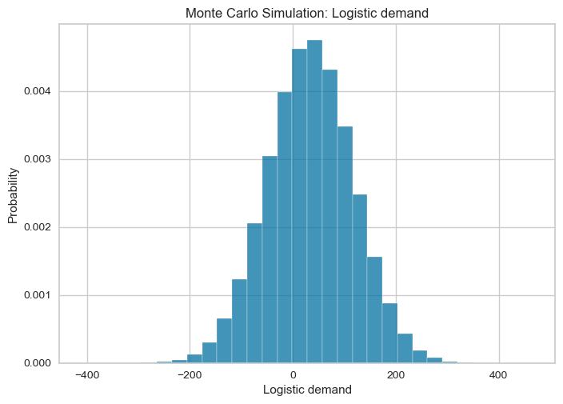

The purpose of the Smart Service Project was to create a smart service for stakeholder included in the EV market transformation in the Netherlands. We have chosen the local UCC, Goederenhub in Maastricht as our stakeholder, and as the end product we provided a dashboard with KPIs for the green transition.

The project goes over the following steps:
1. Data collection
2. Data cleaning
3. Model training
4. Model testing
5. Model predictions
6. Importing and cleaning survey data
7. Exporting the results
8. Monte Carlo

The logistic demand is calculated as follows:
1. A model is trained that predicts the number of businesses per Maastricht region per business type.
2. Survey data is used to determine the average number of pallets delivered per business type in Maastricht.
3. These values are used to determine the total logistic demand (in pallets) of Maastricht.
4. This information is then exported to be used by our dashboard that will make further calculations (number of trucks required, amount of electricity etc.)


SO the two main fronts were forecasting the number of stores per sector based on statistical data and measuring the logistic demand per business type based on our self-conducted survey. Here are some code snippets from the calculations:


## Predicting the number of business

```r
if train_models:
    # Define the different business types.
    # Omitted "OQOverheidOnderwijsEnZorg" - Not enough data
    business_types = ["BFNijverheidEnEnergie",
    "GIHandelEnHoreca", "HJVervoerInformatieEnCommunicatie",
    "KLFinancieleDienstenOnroerendGoed",
    "MNZakelijkeDienstverlening",
    "RUCultuurRecreatieOverigeDiensten"]

    # Create a dictionary to contain all the trained models
    model_dict = {}

    # For every business type, train a model
    for business in business_types:
        print("Now training: " + business)

        # Drop all rows without values
        business_ts = ts_data.dropna(subset=[business])
        business_data = data.dropna(subset=[business])

        # Set up the model training
        # removing multicollinearity (threshold=0.9)
        #setup(
        #    data = business_data,
        #    remove_multicollinearity=True,
        #    ignore_features=["BedrijfsvestigingenTotaal",
                              "Codering", "ID",
                              "year", business_types]
        #)

        # removing multicollinearity (threshold=0.9)
        setup(business_ts,
                    session_id=1,
                    target=business,
                    fold_strategy='timeseries',
                    ignore_features=
                    ["BedrijfsvestigingenTotaal",
                     "Codering", "ID", business_types],
                    fold=5,
                    remove_multicollinearity=True,
                    )

        # Train the models and store the best model
        best_model = compare_models()
        final_model = finalize_model(best_model)
        model_dict[business] = {"Model": final_model,
                                "Business_type": business}

        print(model_dict)
```
The model is trained using the pycaret package. This package includes the "compare_models" function that automatically creates test and train sets, tries different model types and shows a comparison of the different models and their performance.

We run this function for each of business type and store the best model to a dictionary containing the business_type and the model itself. Later we can use these models to make our predictions.


## Predicting logistic demand

```r
mean = survey_df['Average_Total_number_of_palletes_per_month'].values.mean()
std_dev = survey_df['SD_Total_number_of_palletes_per_month'].values.mean()
num_samples = 10000000

samples = np.random.normal(mean, std_dev, num_samples)

mean_samples = np.mean(samples)
std_dev_samples = np.std(samples)

plt.hist(samples, bins=30, density=True, alpha=0.75)
plt.xlabel('Logistic demand')
plt.ylabel('Probability')
plt.title('Monte Carlo Simulation: Logistic demand')
plt.show()

print(f"Mean logistic demand: {mean_samples}")
print(f"Standard deviation of logistic demand:
{std_dev_samples}")
```


```r
Mean logistic demand: 34.328042486634594
Standard deviation of logistic demand: 83.22530494848071
```

Using the results, 3 scenarios got generated:

```r
# Set thresholds for scenario selection
threshold_bad = np.percentile(samples, 2.5)
threshold_good = np.percentile(samples, 97.5)

# Categorize the simulated outcomes
good_scenarios = samples[samples >= threshold_good]
middle_scenarios = samples[
(samples < threshold_good) & (samples > threshold_bad)]
bad_scenarios = samples[samples <= threshold_bad]

# Calculate the probabilities of each scenario
prob_good = len(good_scenarios) / num_samples
prob_middle = len(middle_scenarios) / num_samples
prob_bad = len(bad_scenarios) / num_samples

# Randomly choose a value from the good scenarios
good_value = np.random.choice(good_scenarios)

# Randomly choose a value from the middle scenarios
middle_value = np.random.choice(middle_scenarios)

# Randomly choose a value from the bad scenarios
bad_value = np.random.choice(bad_scenarios)

print(f"Good scenario: {good_value}")
print(f"Middle scenario: {middle_value}")
print(f"Bad scenario: {bad_value}")
print(f"Probability of a good scenario: {prob_good}")
print(f"Probability of a middle scenario: {prob_middle}")
print(f"Probability of a bad scenario: {prob_bad}")
```

```r
Good scenario: 265.58043669036647
Middle scenario: 127.81779907707494
Bad scenario: -178.9709625656634
Probability of a good scenario: 0.025
Probability of a middle scenario: 0.95
Probability of a bad scenario: 0.025
```


Combining the two results from the sources, we created a dashboard in Tableau, where the UCC can personalize the predictions according to their needs and thus invest into the optimal number of EV chargers.





