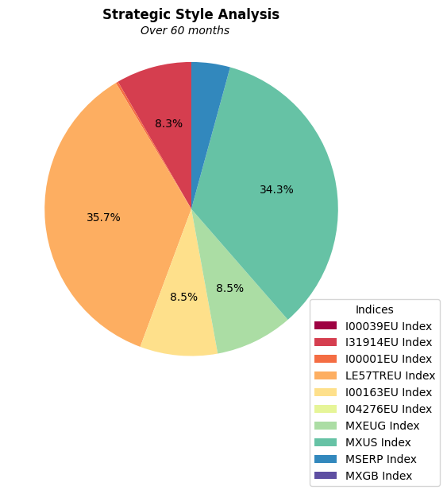
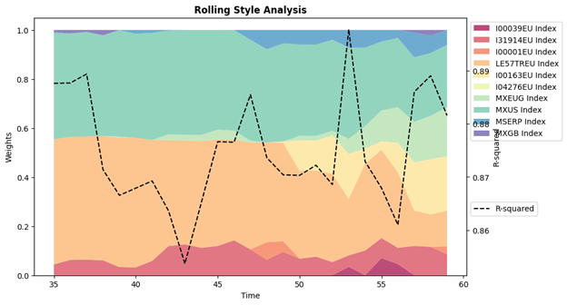

The goal of the project was to explain the returns of a fund by established indices.

By conducting  style analysis, investors and portfolio managers can make informed decisions about the suitability of their portfolios for different market conditions. It offers static and dynamic perspective, acknowledging that market environments change over time, and portfolios need to be adaptable to deliver consistent performance.

## 1. Select indices

```r
selected_indices = ['I00039EU Index','I31914EU Index',
                    'I00001EU Index','LE57TREU Index', 
                    'I00163EU Index', 'I04276EU Index',
                    'MXEUG Index', 'MXUS Index',
                    'MSERP Index', 'MXGB Index']

#variables
y = style_ge['Fund Monthly Return']
x = style_ge.drop(columns=['Fund Monthly Return'])

#define selected predictor variables
x_selected = x[selected_indices]

```

## 2. Startegic Style Analysis
### 2.1 Weight Optimization

```r
# Create DataFrame
df = pd.DataFrame(x_selected)

#list of weights
num_indices = len(selected_indices)

# Initialize weights
initial_weight = 1 / num_indices
initialized_weights = [initial_weight] * num_indices

# Calculate style returns and errors with initialized weights
df['style_returns'] = 
    (x_selected * initialized_weights).sum(axis=1)
df['errors'] = y - df['style_returns']

# Function to calculate EV
def EV(weights, x, y):
    style_returns = np.dot(x, weights)
    errors = y - style_returns
    return np.var(errors)

# Constraint: sum of weights is 1
constraint = ({'type': 'eq',
               'fun': lambda w: np.sum(w) - 1})

# Bounds: each weight should be between 0 and 1
bounds = [(0, 1) for _ in range(num_indices)]

# Initial guess for weights
initial_guess = initialized_weights

# Perform optimization
result = minimize(EV, initial_guess,
                  args=(x_selected.values, y), 
                  method='SLSQP', bounds=bounds,
                  constraints=constraint)

# Extract optimized weights
optimized_weights = result.x

# Apply optimized weights to calculate
# style returns and errors
df['optimized_style_returns'] =
(x_selected * optimized_weights).sum(axis=1)
df['optimized_errors'] = y - df['optimized_style_returns']

#R-squared
FV = np.var(y)
EV_opt = EV(optimized_weights, x_selected.values, y)
r_squared=1-(EV_opt/FV)

# Create a DataFrame with optimized weights
# and corresponding index names
optimized_weights_df = pd.DataFrame(
    {'Indices': selected_indices,
     'Optimized_Weight': optimized_weights})

# Print  optimized weights 
print("Optimized Weights:")
print(optimized_weights_df.sort_values(
        by="Optimized_Weight", ascending=False))
print('\nR²:', r_squared)

```

### 2.2 Results

```r
Optimized Weights:
          Indices  Optimized_Weight
3  LE57TREU Index      3.573870e-01
7      MXUS Index      3.431106e-01
6     MXEUG Index      8.546427e-02
4  I00163EU Index      8.541785e-02
1  I31914EU Index      8.339464e-02
8     MSERP Index      4.263598e-02
2  I00001EU Index      2.589715e-03
0  I00039EU Index      2.907976e-16
5  I04276EU Index      1.990585e-16
9      MXGB Index      0.000000e+00

R²: 0.8641062782582419

```

### 2.3 Overview of Optimized Weights



The chosen indices explain all togather 86.4% of the variance in the fund returns. This is mostly thanks to the **LE57TREU** and **MXUS** indices, which togather represent 70% of the weights. This means that the investment styles of LE57TREU and MXUS align the most with the fund's overall investment style.Afterwards the **MXEUG, I00163EU, I31914EU, MSERP** indices, focusing more on the emerging markets and the Pacific region are filling the remaining gaps, leaving the United Kingdom insignificant.


## 3. Rolling Style Analysis
### 3.1 Weight Optimization

```r
# Function to get effective weights and optimized EV
# for a rolling window

def get_effective_weights_and_EV(x, y, window_size):
    effective_weights_list = []
    optimized_EV_list = []
    r_squared_list = []

    for i in range(len(x) - window_size + 1):
        # Extract data for the current window
        x_window = x.iloc[i:i+window_size]
        y_window = y.iloc[i:i+window_size]

        # Initialize weights
        num_indices = len(x_window.columns)
        initial_weight = 1 / num_indices
        initialized_weights = [initial_weight 
        for _ in range(num_indices)]

        # Constraint: sum of weights is 1
        constraint = ({'type': 'eq',
                       'fun': lambda w: np.sum(w) - 1})

        # Bounds: each weight should be between 0 and 1
        bounds = [(0, 1) for _ in   
                  range(len(initialized_weights))]

        # Initial guess for weights
        initial_guess = initialized_weights

        # Perform optimization for the current window
        result = minimize(EV, initial_guess,
                          args=(x_window.values, y_window),
                          method='SLSQP', bounds=bounds,
                          constraints=constraint)

        # Extract optimized weights and EV
        optimized_weights = result.x
        optimized_EV = EV(optimized_weights,
                          x_window.values,
                          y_window)

        # Calculate FV for the current window
        current_FV = np.var(y_window)

        effective_weights_list.append(optimized_weights)
        optimized_EV_list.append(optimized_EV)
        r_squared_list.append(1 - (optimized_EV / current_FV))

    return pd.DataFrame(effective_weights_list,
                        columns=x.columns),
                        optimized_EV_list, 
                        r_squared_list

# Set the rolling window size
window_size = 36

# Get effective weights and Rsquared for each rolling window
effective_weights_df, optimized_EV_list, r_squared_list = 
get_effective_weights_and_EV(x_selected,  y, window_size)

# Display the head of the effective_weights_df 
print("Effective Weights:")
print(effective_weights_df.head())

# Display the head of the r_squared_list
print("\nR-squared List:")
print(r_squared_list)  # Displaying the first 5 elements

```


### 3.2 Results
```r
Effective Weights:
   I00039EU Index  I31914EU Index  I00001EU Index  \
0    1.771927e-15        0.043949    0.000000e+00          
1    2.320798e-16        0.062601    2.514525e-16          
2    5.375964e-16        0.063621    0.000000e+00           
3    7.491378e-16        0.060840    0.000000e+00           
4    0.000000e+00        0.033425    0.000000e+00         

   LE57TREU Index I00163EU Index  I04276EU Index   \
0        0.510126            0.0    1.193084e-15      
1        0.501998            0.0    9.465356e-16       
2        0.502190            0.0    2.121255e-16         
3        0.507362            0.0    0.000000e+00       
4        0.527004            0.0    0.000000e+00         

     MXEUG Index  MXUS Index   MSERP Index     MXGB Index  
0   2.708998e-16    0.433048  4.717653e-03   8.159452e-03  
1   0.000000e+00    0.421386  0.000000e+00   1.401562e-02  
2   0.000000e+00    0.426593  5.430184e-17   7.596152e-03  
3   0.000000e+00    0.410116  0.000000e+00   2.168127e-02  
4   5.032791e-03    0.433474  1.063577e-03   4.084893e-17  

R-squared List:
[0.887637054213982, 0.8877011544478849, 0.8893914869239011, 
0.8713920795217971,0.8665540946770064, 0.8679043900554069, 
0.8692618080938903,0.8636292674059939, 0.8537008922721883, 
0.8651509826300484, 0.8766494608118417, 0.8765565849152005, 
0.8855102098710597, 0.8736283372886974, 0.8704095128028273,
0.8703170437866761,0.8722239322596772, 0.8685778868775915,
0.8977930477888213, 0.8729195475342553,0.8679203330957813, 
0.860990109592243, 0.8860318848282231, 0.889069449817989, 
0.8815811147382123]

```
### 2.3 Overview of Optimized Weights over time




As the graph shows, the main predictors over time are the **LE57TREU** and **MXUS** indices, in harmony with the findings of the the startegic analysis. Together with the **I31914EU** index these three seem to have a stable significant presence. However, the role of the other indices are rather fluctuating, and they just appear in the second half of the rolling. The complexity of predicting the fund with these indices is represented with the path of the r-squared over time, which is rather volatile. But after having a closer look it is clear that the r-square moves between 85% and 90%, which implies trustworty results.
